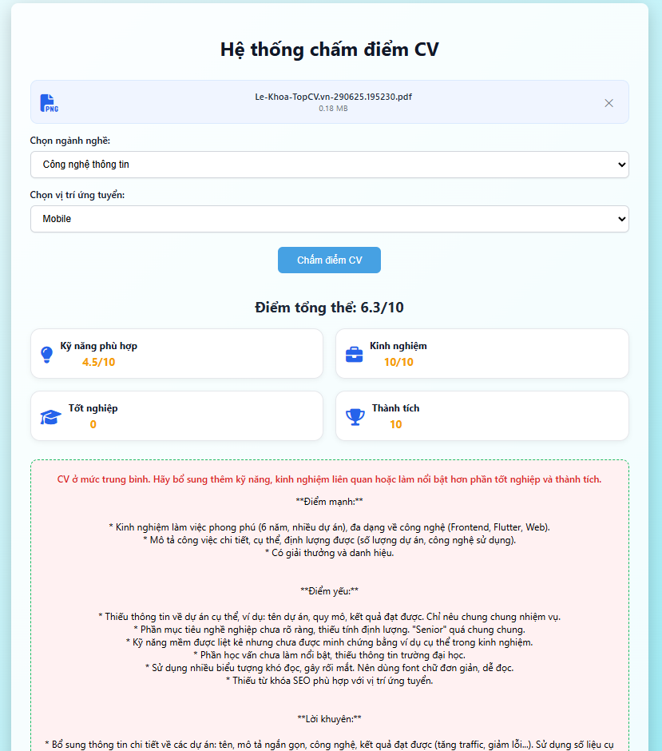

# CV Score Analyzer

Một hệ thống **chấm điểm CV tự động** dựa trên AI, giúp đánh giá sơ yếu lý lịch của ứng viên một cách nhanh chóng và chính xác. Được phát triển phục vụ cho bài tập môn học tại Đại học FPT, công cụ này cho phép bạn **tải lên CV (PDF), chọn ngành/vị trí, và nhận ngay phân tích chi tiết cũng như điểm số AI**.

## 🌟 Tính năng nổi bật

- **Tích hợp AI:** Sử dụng Google Gemini để đưa ra nhận xét chi tiết và đề xuất cải thiện cho từng CV.
- **Chấm điểm tự động:** Đánh giá dựa trên mức độ phù hợp kỹ năng, kinh nghiệm, học lực và thành tích bằng hệ thống minh bạch, dễ hiểu.
- **Hỗ trợ đa ngành:** Sẵn sàng cho CNTT, Marketing, Kế toán, Tài chính, Nhân sự...
- **Giao diện thân thiện:** Trải nghiệm tải lên & phân tích trong trình duyệt siêu đơn giản.
- **Công nghệ hiện đại:** Node.js (Express), JavaScript, phân tích PDF.
- **Kết quả tức thì:** Hiển thị điểm số tổng hợp và nhận xét chi tiết bằng số và ngôn ngữ tự nhiên.

## 🖥️ Ảnh minh họa

 <!-- Thay bằng ảnh demo của bạn! -->

## 🔧 Cách sử dụng

1. **Tải lên CV (file PDF).**
2. **Chọn ngành học & vị trí ứng tuyển.**
3. **Nhấn “Phân tích”**—CV sẽ được chấm điểm qua cả luật và AI.
4. **Xem kết quả chi tiết:** Mức độ phù hợp kỹ năng, kinh nghiệm, học lực, thành tích, điểm tổng và gợi ý AI.

## 🤖 Nguyên lý chấm điểm

- **Kỹ năng:** So sánh cosine giữa từ khóa ngành nghề và nội dung CV.
- **Kinh nghiệm:** Trích xuất số năm kinh nghiệm từ nội dung CV.
- **Học lực:** Nhận diện GPA/xếp loại (ví dụ: Giỏi/Khá/Excellent).
- **Thành tích:** Phát hiện giải thưởng & thành tựu nổi bật.
- **Điểm tổng hợp:** Tính theo tỷ trọng (kỹ năng 40%, kinh nghiệm 30%, học lực 15%, thành tích 15%).
- **Nhận xét AI:** Google Gemini tạo review cá nhân hóa bằng tiếng Việt.

## 🛠️ Hướng dẫn cài đặt nhanh

Chạy lệnh sau để cài thư viện:
```bash
npm install express multer cors @google/generative-ai pdfjs-dist
```
Hoặc cài từng gói:
```bash
npm install express
npm install multer
npm install cors
npm install @google/generative-ai
npm install pdfjs-dist
```

## 🚀 Khởi động nhanh

1. **Cài đặt thư viện**  
   (như hướng dẫn phía trên)

2. **Chạy server**
   ```bash
   node server.js
   ```
   Server mặc định ở http://localhost:3000

3. **Mở index.html**  
   Hoặc vào http://localhost:3000 bằng trình duyệt.

## 📁 Cấu trúc dự án

```
├── node_modules/
├── public/
│   ├── index.html
│   ├── style.css
│   └── (có thể bổ sung các file js, img nếu cần)
├── uploads/               # Thư mục lưu file tải lên tạm thời
├── server.js              # File chạy Express backend
├── package.json
├── package-lock.json
```


**Giải thích:**
- **public/**: Chứa toàn bộ tài nguyên phía frontend (HTML, CSS, JS, ảnh,...). Express sẽ cấu hình để phục vụ tĩnh từ thư mục này.
- **uploads/**: Chứa file CV PDF được upload, thường sẽ cho vào gitignore.
- **server.js**: Chứa toàn bộ code backend, API, AI xử lý (không nằm trong public nữa).
- **node_modules/**, **package.json**, **package-lock.json**: Chuẩn Node.js.

**Lưu ý:**  
Bạn nên cập nhật lại README.md và cấu hình lại đường dẫn static trong server.js như sau:
```js
app.use(express.static('public'));
```

Nếu cần bổ sung file JS cho frontend hoặc chia nhỏ CSS, có thể đặt vào `public/js/`, `public/css/`...

## 🛡️ Lưu ý bảo mật

API Key: Khóa API Google Gemini đang để trong server.js cho mục đích demo/bài tập. Tuyệt đối KHÔNG commit key thật lên repo công khai!

Để bảo mật: Dùng biến môi trường (vd: process.env.GEMINI_KEY) và thêm .env vào .gitignore.

## 📚 Cảm ơn

- Google Gemini — Gợi ý AI & nhận xét CV
- pdfjs-dist — Trích xuất nội dung từ file PDF
- Font Awesome — Icon cho giao diện

Dự án bởi Nhóm 1 , Đại học FPT, môn ITA301.
